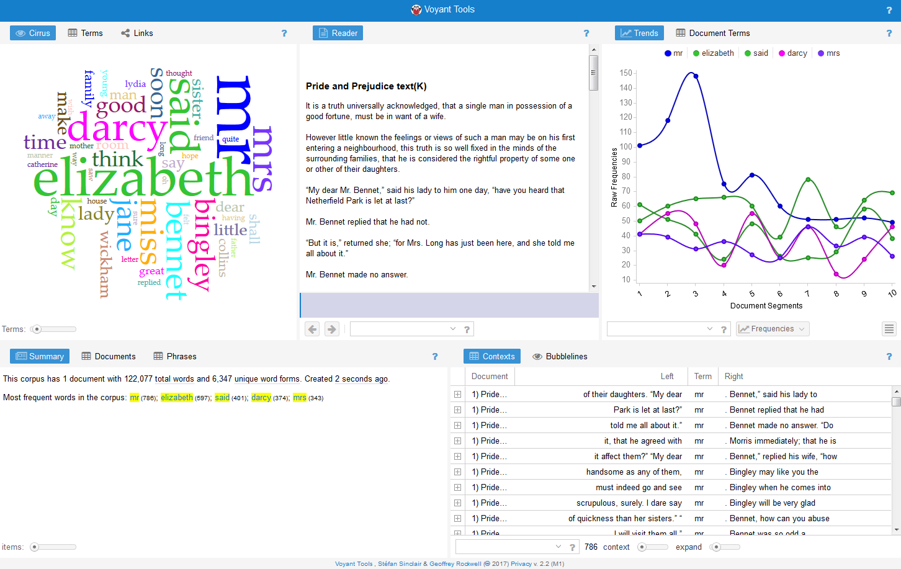

# How to Get Started with the Digital Humanities in 2023 and Why

## Introduction

{width=150px style="float:right;"}

[Watch this video on YouTube](https://www.youtube.com/embed/k-_GmWw3pvI?list=PLgb7wGdsYkJz-1EzcJ0XFdk1mEGxpfCHl)

## Start with a Problem

As you progress through your career in the digital humanities, you will acquire skills on a need-to-acquire basis. Every day I learn something new. This is because every day, I encounter new problems that need solving.

Before, during, or after learning the basics of the digital humanities, I recommend jumping straight into a personal project. This will allow you to begin formally creating a portfolio. It also gets you at the heart of what it means to be a digital humanist; a digital humanist is a problem solver.

This personal project should be rooted in a problem that is interesting to you. If you cannot think of a problem, think about what is something you want to see, but doesn’t exist anywhere online? What things are you doing in your research workflow that would make research much easier? If you are thinking these things about your narrow topic, then chances are someone else is thinking something similar about an adjacent one. At the end of the day, the digital humanities comes down to solving problems.

What makes a good problem? Anything, really. Think about your own areas of expertise. Do you want to know all the ways Shakespeare uses sword-imagery in his plays? Figure out how to automate the identification of sword imagery and then collate the results. Want to share that project with the world? Learn how to make a website; more importantly, learn what specific website framework is right for querying a database. Want to make that website more advanced looking? Learn JavaScript. Want to build it into a stand-alone app for mobile devices? Learn React Native. Each one of these tasks is very challenging; you will not do them over night, but solving each one of these smaller problems will build a skill set that you can then apply to other problems much more easily. And here is the fun part, the first version of all these things you do will be so bad that you will probably feel embarrassed to share it with the world; don’t. you may have extreme imposter syndrome; resust that feeling as much as you can. Be proud of your bad work. That work represents some of the most character-building and skill-learning moments of your career. You will always continue to grow and your earlier work will always reflect that growth. As you develop your skills, you can always go back and improve your earlier projects.

Again, I am coming to this from personal experience. The very first thing I tried to do with a programming language was design a program that could show how individuals who commented on Scripture were connected across medieval Europe through commentaries (a type of book where an author examined the Bible). At the time, I had no programming knowledge. I didn’t know where to start. All I knew at the time was that the available tools couldn’t handle my particular problem for several reasons, one being that my dates had 3 numbers and were very imprecise. This meant I could not use the year 736 in available tools. (I believe there are tools that can handle dates with 3 digits now). Imprecise dates presented other challenges. In many cases, I was lucky to date a work to a ten-year window. It took me an entire summer (nearly 3 months) to build what I consider the best and worst app I have ever made. I built it entirely in Python with Tkinter, a framework for building local apps. This meant it could not be shared on the web and anyone who wanted to use it had to have Python installed. If I compiled it into a .exe file, it was 200mb large and very slow. But it worked. It allowed you to select a person or persons and it would draw their network for you with NetworkX and Matplotlib, two libraries in Python that allow you to perform network analysis. Today, I can build the same app in an hour; it would be cloud-based; and it would be far faster and better written. The reason for this is because in the past 5 years, I have continued to develop my skills by solving other problems.

I have built a lot of apps over the past few years, but I am still most proud of that awful network app. The reason? Because I learned more in those three months about programming, terminology, concepts, etc. than I ever would have if I had not started with a problem I cared about. I needed to solve that problem. It was fundamental to my research. The fact that it was important to me made me all the more determined to finish it. Do not just start with any problem. Start with a problem that matters to you. And never be ashamed of the work you produce in the course of solving that problem. You can always go back and make it better later. Use that initial problem to gather the key fundamentals you need. If anyone critiques your work, ask them why and ask for ways to improve it; if they don’t offer help beyond a general critique, then ignore them. Also, you can always share the project with me on Twitter. I often help students who send me direct messages.

It is important to remember that as you solve a problem, do not just try and solve it. Remember, you are also focused on developing the skills necessary to solve it. And most importantly, do not give up. If you get frustrated, get up and go for a walk outside. If you are not finding one resource useful, find another. If you cannot find a particular resource, ask digital humanists for help. It is a very encouraging community that seeks to help others. If you are struggling with one aspect of the project, stop and try to work on another aspect. Each of these things will help you continue. When I was designing my first app, I quit a dozen times a day, but then kept coming back to the computer to pick up where I left off. It was painful and grueling, but every single time you get through a road block, no matter how small, you feel this major sense of accomplishment. That feeling indicates the acquisition of a new skill or concept that you didn’t have before. The next time you encounter that same problem (and you likely will!), you will solve it in seconds rather than hours.  

## What can I do with these Skills?

As you learn these new skills, you will find that they are oftentimes universally applicable to other problems. You can take the skills you acquired and then start solving other problems outside your field. This was how I got started working on projects outside of my domain (area of expertise). Today, I work on projects related to the Holocaust, Apartheid South Africa, and modern gender history. These are well outside my area of expertise, but the skills I developed working on medieval material are directly beneficial to these modern-focused projects. In other words, these skills allow you to expand how you market yourself. In academia, we are often very limited in our focus and we only apply for jobs that fit a certain criteria. If you have skills in digital humanities, you can market yourself inside and outside of academia with that skill set, not just your area of expertise.

The digital humanities is a great way to engage with your own discipline through new, modern methods. Your knowledge of the digital humanities will never be complete. Methods are developing at a rapid pace, thanks to machine learning. New projects present great new angles to approach problems. It is an increasing area of research and this activity makes it always interesting.  
